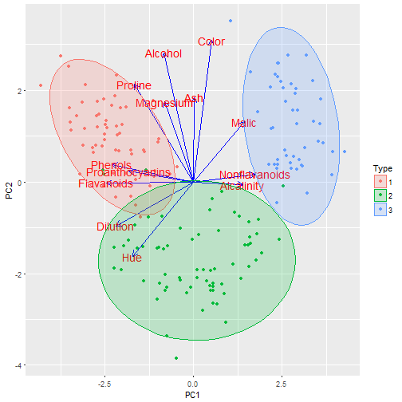

Principal Components Analysis (PCA) for Wine Dataset
========================================================
author: Eakalak Suthampan
date: 26 Febuary 2017
autosize: true

Introduction
========================================================

This project will use Principal Components Analysis (PCA) technique to do data exploration on the Wine dataset and then use PCA conponents as predictors in RandomForest to predict wine types.

The shiny app for this project is at
[https://suteak.shinyapps.io/dev_data_product/](https://suteak.shinyapps.io/dev_data_product/)

The source code for this project are at
[https://github.com/eakalak-suthampan/dev_data_product](https://github.com/eakalak-suthampan/dev_data_product)

The presentation for this project is at
[http://rpubs.com/suteak/253795](http://rpubs.com/suteak/253795)

Wine Dataset
========================================================
There are 13 predictors to predict Wine Types (3 Types)

```r
data(wine, package = 'rattle')
str(wine,list.len = 5)
```

```
'data.frame':	178 obs. of  14 variables:
 $ Type           : Factor w/ 3 levels "1","2","3": 1 1 1 1 1 1 1 1 1 1 ...
 $ Alcohol        : num  14.2 13.2 13.2 14.4 13.2 ...
 $ Malic          : num  1.71 1.78 2.36 1.95 2.59 1.76 1.87 2.15 1.64 1.35 ...
 $ Ash            : num  2.43 2.14 2.67 2.5 2.87 2.45 2.45 2.61 2.17 2.27 ...
 $ Alcalinity     : num  15.6 11.2 18.6 16.8 21 15.2 14.6 17.6 14 16 ...
  [list output truncated]
```

PCA plot
========================================================



PCA will be used to reduce 13 predictors variables to 2 PCA variables. The "autoplot" function can be used to plot PCA.

Prediction Model
========================================================
2 PCA variables will be used as predictors in RandomForest to predict wine types.


```r
rfFit <- randomForest(Type ~ PC1 + PC2, data = pca.train.df)
paste("training accuracy is",confusionMatrix(training$Type,predict(rfFit))$overall[1]*100,"%")
```

```
[1] "training accuracy is 95.0617283950617 %"
```

```r
paste("testing accuracy is",confusionMatrix(testing$Type,predict(rfFit,pca.test.df))$overall[1]*100,"%")
```

```
[1] "testing accuracy is 100 %"
```

